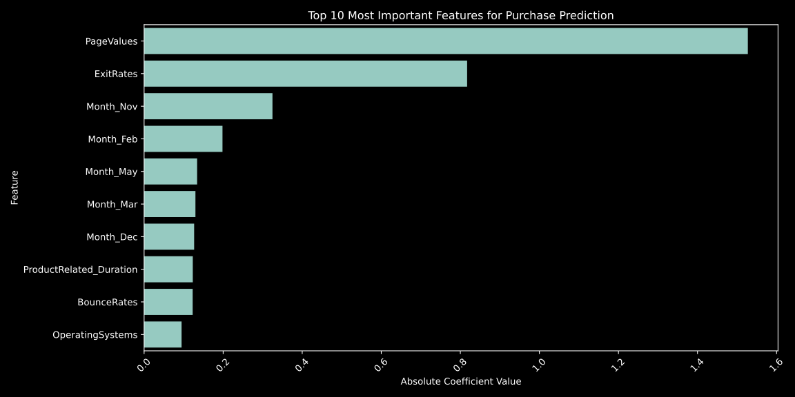

# DS2010 Final Project

Analyzing online shopping data to determine what affects a customer’s tendency to make a purchase.

## Running

Poetry is used to manage dependencies. To install dependencies, run:

```bash
poetry install
```

To run the project, run:

```bash
poetry run python shop-data.py
```

The plots are saved in the `plots` directory.

## Example Output

Here's the output for out dataset using a logistic regression model, as of 3 December 2024:


